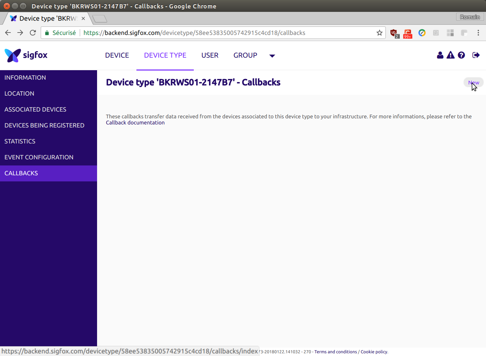
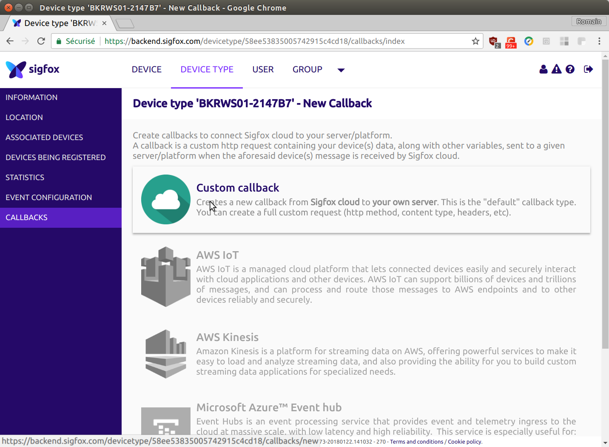
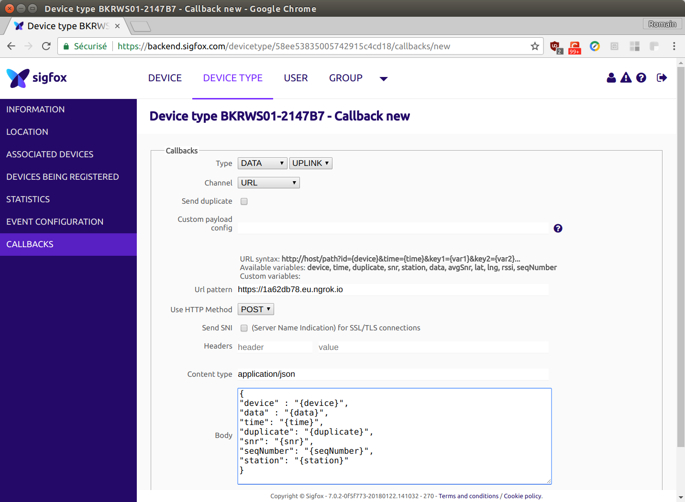

# Message with NODEMCU (ESP8266) and BRKWS01 (Sigfox Wisol SFM10R1) to your python Flask backend

Learn to send a Sigfox message with a NodeMCU (ESP8266) and BRKWS01 (Sigfox Wisol module - SFM10R1) - to your python Flask backend

## Requirements
### Hardware 
* [NodeMCU](https://fr.aliexpress.com/item/New-Wireless-module-NodeMcu-Lua-WIFI-Internet-of-Things-development-board-based-ESP8266-with-pcb-Antenna/32656775273.html)
* [SNOC Breakout Board - Sigfox BRKWS01](https://yadom.fr/carte-breakout-sfm10r1.html)

### Subscription
* Sigfox subscription
* [Sigfox Backend Account](https://backend.sigfox.com/)

### Software
* [Arduino IDE](https://www.arduino.cc/en/Main/Software)
* [ESP8266 board and lib for Arduino IDE](https://github.com/esp8266/Arduino)

## Hardware pinout
* ### NodeMCU


* ### SNOC Breakout Board - Sigfox BRKWS01


## Get SigFox modem module ID and PAC number

To communicate with the SigFox modem, we use UART, and you have to send AT commands to the SigFox modem,

Some simple AT commands:

AT command | Description
-----------|-------------
AT$I=10    | Get Device ID
AT$I=11    | Get PAC Number
AT$SF=XX   | Send XX (payload data of size 1 to 12 bytes)

First, we must recover the Device ID and PAC number of the SigFox module.

Thanks to the device ID and PAC number, we can identify the modem, take a subscription and register  in the sigfox backend.

Device ID is an unique id for the module
PAC number is a security key that can be used once and changes every use.

So, copy/past in your arduino IDE, and read the result in the Serial Monitor

```c
/*
 * Romain Tribout - 28/01/2018
 * Learn to send a Sigfox message with
 * NodeMCU (ESP8266) 
 * BRKWS01 (Sigfox Wisol module - SFM10R1)
*/

#include <SoftwareSerial.h>


#define RxNodePin 13
#define TxNodePin 15

// Setup UART Communication with 
SoftwareSerial Sigfox =  SoftwareSerial(RxNodePin, TxNodePin);

// 12 bytes message buffer
uint8_t sigfoxMsg[12];

void setup () {
  Serial.begin(115200);
  delay(200);
  Serial.println("\n***** START *****");


  pinMode(RxNodePin, INPUT);
  pinMode(TxNodePin, OUTPUT);
  Sigfox.begin(9600);
  delay(100);

  Serial.print("Device ID: " + getID()); 
  Serial.print("Device PAC Number: " + getPAC());
}

void loop () {
  
}

// Get device ID
String getID () {
  String deviceId = "";
  char sigfoxBuffer;

  // Send AT$I=10 to WISOL to GET ID number
  Sigfox.print("AT$I=10\r");

  while (!Sigfox.available()){
     delay(10);
  }
  
  while(Sigfox.available()){
    sigfoxBuffer = Sigfox.read();
    deviceId += sigfoxBuffer;
    delay(10);
  }
  return deviceId;
}


// Get PAC number
String getPAC (){
  String pacNumber = "";
  char sigfoxBuffer;

  // Send AT$I=11 to WISOL to GET PAC number
  Sigfox.print("AT$I=11\r");
  while (!Sigfox.available()){
     delay(10);
  }
  while(Sigfox.available()){
    sigfoxBuffer = Sigfox.read();
    pacNumber += sigfoxBuffer;
    delay(10);
  }
  return pacNumber;
}
```

You must get this result:


## Send your first Sigfox message 

Now we will send our first sigfox messages. With the sigfox protocol, we can send messages of 12 bytes.

Due to the reglementation, in the ETSI zone, an object cannot emit more than 1% of the time hourly

* 1 hour = 3600 sec
* 1% of 3600 sec = 36 sec

A Sigfox message takes 6 seconds to emit
* 36 sec / 6 sec = 6 messages per hours
* 1 every 10 minutes


That's why subscriptions are limited to 140 messages per day. 

140 messages * 10 minutes = 1400 ≈ 24 hours

Here is the function to send a sigfox message:

```c
String sendMessage(uint8_t sigfoxMsg[], int bufferSize) {
  String status = "";
  char sigfoxBuffer;

  // Send AT$SF=xx to WISOL to send XX (payload data of size 1 to 12 bytes)
  Sigfox.print("AT$SF=");
  for(int i= 0;i<bufferSize;i++){
    if (sigfoxMsg[i]<0x10) {
      Sigfox.print("0");
    }
    Sigfox.print(String(sigfoxMsg[i], HEX));
  }

  Sigfox.print("\r");

  while (!Sigfox.available()){
     delay(10);
  }

  while(Sigfox.available()){
    sigfoxBuffer = (char)Sigfox.read();
    status += sigfoxBuffer;
    delay(10);
  }

  return status;
}
```

With all the code, and a message every 10 minutes. Copy/past in your arduino IDE:


```c
/*
 * Romain Tribout - 28/01/2018
 * Learn to send a Sigfox message with
 * NodeMCU (ESP8266) 
 * BRKWS01 (Sigfox Wisol module - SFM10R1)
*/

#include <SoftwareSerial.h>


#define RxNodePin 13
#define TxNodePin 15

// Setup UART Communication with 
SoftwareSerial Sigfox =  SoftwareSerial(RxNodePin, TxNodePin);

// 12 bytes message buffer
uint8_t sigfoxMsg[12];

void setup () {
  Serial.begin(115200);
  delay(200);
  Serial.println("\n***** START *****");


  pinMode(RxNodePin, INPUT);
  pinMode(TxNodePin, OUTPUT);
  Sigfox.begin(9600);
  delay(100);

  Serial.print("Device ID: " + getID()); 
  Serial.print("Device PAC Number: " + getPAC());
  delay(100);
}

void loop () {
  sigfoxMsg[0]=0x01;
  sigfoxMsg[1]=0x23;
  sigfoxMsg[2]=0x45;
  sigfoxMsg[3]=0x67;
  sigfoxMsg[4]=0x89;
  Serial.println("Send message: " + sendMessage(sigfoxMsg, 5));

  // Send every 10 minutes
  delay(60000);
}

// Get device ID
String getID () {
  String deviceId = "";
  char sigfoxBuffer;

  // Send AT$I=10 to WISOL to GET ID number
  Sigfox.print("AT$I=10\r");

  while (!Sigfox.available()){
     delay(10);
  }
  
  while(Sigfox.available()){
    sigfoxBuffer = Sigfox.read();
    deviceId += sigfoxBuffer;
    delay(10);
  }
  return deviceId;
}


// Get PAC number
String getPAC (){
  String pacNumber = "";
  char sigfoxBuffer;

  // Send AT$I=11 to WISOL to GET PAC number
  Sigfox.print("AT$I=11\r");
  while (!Sigfox.available()){
     delay(10);
  }
  while(Sigfox.available()){
    sigfoxBuffer = Sigfox.read();
    pacNumber += sigfoxBuffer;
    delay(10);
  }
  return pacNumber;
}

String sendMessage(uint8_t sigfoxMsg[], int bufferSize) {
  String status = "";
  char sigfoxBuffer;

  // Send AT$SF=xx to WISOL to send XX (payload data of size 1 to 12 bytes)
  Sigfox.print("AT$SF=");
  for(int i= 0;i<bufferSize;i++){
    if (sigfoxMsg[i]<0x10) {
      Sigfox.print("0");
    }
    Sigfox.print(String(sigfoxMsg[i], HEX));
  }

  Sigfox.print("\r");

  while (!Sigfox.available()){
     delay(10);
  }

  while(Sigfox.available()){
    sigfoxBuffer = (char)Sigfox.read();
    status += sigfoxBuffer;
    delay(10);
  }

  return status;
}
```

## See your messages in the Sigfox Backend

Go to https://backend.sigfox.com and login.

In the device list, find your device using the device ID, and click on it.


## Forward messages to your own python Flask backend

### Optional
We can use Ngrok tools, ngrok create a secure tunnels to your localhost: https://ngrok.com/

Thanks to Ngrok you can test without deploying. 

Download it and run it, for exemple in ubuntu

```bash
./ngrok http 5000 -region eu
```
For example, you can see a public URL in your terminal


### Configure Sigfox backend



