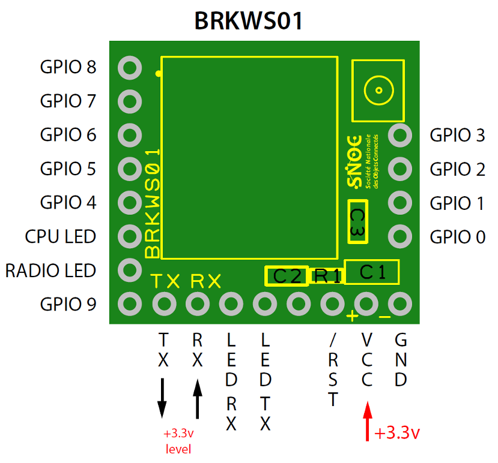

# Message with NODEMCU (ESP8266) and BRKWS01 (Sigfox Wisol SFM10R1)

Learn to send a Sigfox message with a NodeMCU (ESP8266) and BRKWS01 (Sigfox Wisol module - SFM10R1) - Backend Sigfox

## Requirements
### Hardware 
* [NodeMCU](https://fr.aliexpress.com/item/New-Wireless-module-NodeMcu-Lua-WIFI-Internet-of-Things-development-board-based-ESP8266-with-pcb-Antenna/32656775273.html)
* [SNOC Breakout Board - Sigfox BRKWS01](https://yadom.fr/carte-breakout-sfm10r1.html)

### Subscription
* Sigfox subscription
* [Sigfox Backend Account](https://backend.sigfox.com/)

### Software
* [Arduino IDE](https://www.arduino.cc/en/Main/Software)
* [ESP8266 board and lib for Arduino IDE](https://github.com/esp8266/Arduino)

## Hardware pinout
* ### NodeMCU


* ### SNOC Breakout Board - Sigfox BRKWS01



## Get SigFox modem module ID and PAC number

To communicate with the SigFox modem, we use UART, and you have to send AT commands to the SigFox modem,

Some simple AT commands:

AT command | Description
-----------|-------------
AT$I=10    | Get Device ID
AT$I=11    | Get PAC Number
AT$SF=XX   | Send XX (payload data of size 1 to 12 bytes)

First, we must recover the Device ID and PAC number of the SigFox module.

Thanks to the device ID and PAC number, we can identify the modem, take a subscription and register  in the sigfox backend.

Device ID is an unique id for the module
PAC number is a security key that can be used once and changes every use.

So, copy/past in your arduino IDE, and read the result in the Serial Monitor

```c
/*
 * Romain Tribout - 28/01/2018
 * Learn to send a Sigfox message with
 * NodeMCU (ESP8266) 
 * BRKWS01 (Sigfox Wisol module - SFM10R1)
*/

#include <SoftwareSerial.h>


#define RxNodePin 13
#define TxNodePin 15

// Setup UART Communication with 
SoftwareSerial Sigfox =  SoftwareSerial(RxNodePin, TxNodePin);

// 12 bytes message buffer
uint8_t sigfoxMsg[12];

void setup () {
  Serial.begin(115200);
  delay(200);
  Serial.println("\n***** START *****");


  pinMode(RxNodePin, INPUT);
  pinMode(TxNodePin, OUTPUT);
  Sigfox.begin(9600);
  delay(100);

  Serial.print("Device ID: " + getID()); 
  Serial.print("Device PAC Number: " + getPAC());
}

void loop () {
  
}

// Get device ID
String getID () {
  String deviceId = "";
  char sigfoxBuffer;

  // Send AT$I=10 to WISOL to GET ID number
  Sigfox.print("AT$I=10\r");

  while (!Sigfox.available()){
     delay(10);
  }
  
  while(Sigfox.available()){
    sigfoxBuffer = Sigfox.read();
    deviceId += sigfoxBuffer;
    delay(10);
  }
  return deviceId;
}


// Get PAC number
String getPAC (){
  String pacNumber = "";
  char sigfoxBuffer;

  // Send AT$I=11 to WISOL to GET PAC number
  Sigfox.print("AT$I=11\r");
  while (!Sigfox.available()){
     delay(10);
  }
  while(Sigfox.available()){
    sigfoxBuffer = Sigfox.read();
    pacNumber += sigfoxBuffer;
    delay(10);
  }
  return pacNumber;
}
```

You must get this result:


## Send your first Sigfox message 